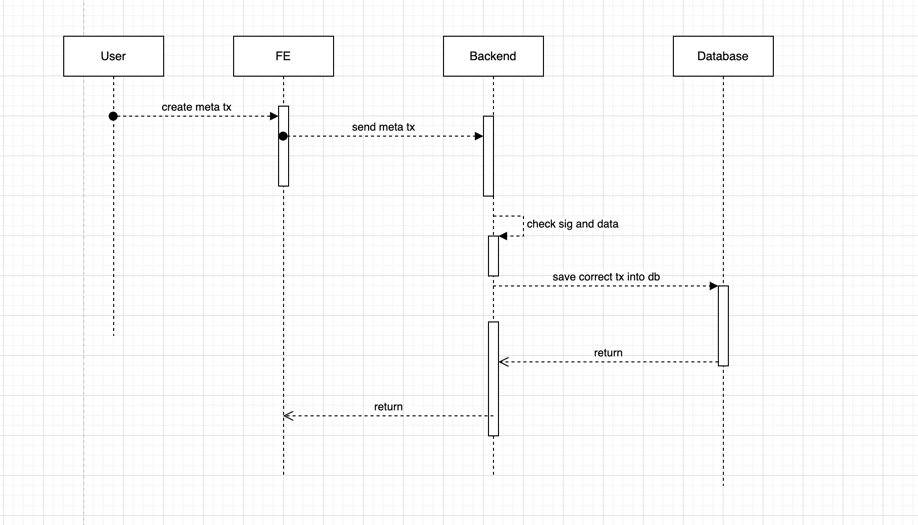
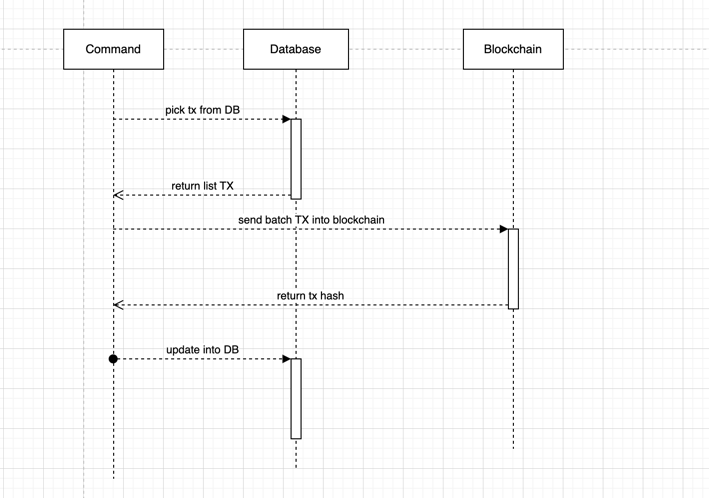

## Description

This is my backend. It will include the api to create the meta transaction and save it to the database.
In addition, it will also include a command to execute the batch transaction and push it to the Blockchain.

## Installation and Run
1. create .env file and fill value:
```
$ cp .env.example .env
```

1. Run mysql:
```bash
$ docker-compose up -d
```
3. After that, we need install libraries: 
```bash
$ yarn 
```

4. Create database:
```bash
$ yarn typeorm:run
```
4. Run app:
```bash
$ yarn start:dev
```

5. You need open other terminal and run commands:
```bash
$ yarn console:dev send-tx
```

## About project
I also create swagger for my project. You can see list api in [here](http://localhost:8001/docs/)
Technical stack: Nestjs + MySql

System design is scalable (run many instances). In addition, it also supports multiple chain, multiple signer.

Flow of Project: 




We have 2 tables in database:
1. chain_info: I save the chain's information.
   To distinguish the chains, I save the key in the format: chainId + variable name. Example: 97_nonce
   -> store nonce in chain bsc testnet
2. transaction_records: I save the meta transaction with status. It contains some fields: 
    - user_address: address of the user who created the transaction
    - target_transaction: address of the target transaction.
    - call_data: hex data of meta transaction.
    - status: status of the transaction (pending, processing, success, failed)
    - tx_hash: tx hash when transaction is successfully processed.

## In the future
Because I only have a few days to develop the project from FE, BE, SC, so our project has some limitations. Some features we can develop in the future:
1. Handling when transaction failed.
2. Break down the steps of sending transaction:
- 1 job that retrieves transaction and generates raw data
- 1 job to get raw data and sign
- 1 job to get signed data to send to blockchain
- 1 job verify and handle when tx failed